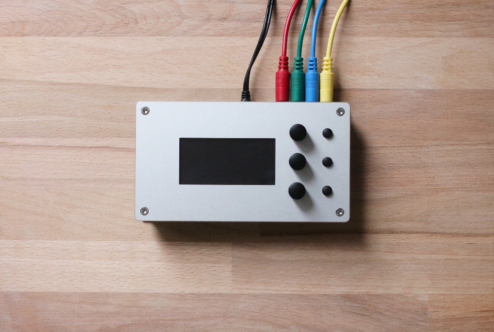

# Nordhat & audio expansion board

Please read the [Notes](hardware/notes.md)

***The actual Nordhat board is probably NOT compatible with the new Raspberry Pi 4. The position of the Ethernet socket and USB sockets have changed in this latest revision of the PI and the Nordhat main PCB might not be adapted anymore.*** 

### Bill of material
[Main board](hardware/bom/BOM_mainboard_nordhat.csv)

[Expansion board](hardware/bom/BOM_expansion_board_nordhat.csv)

### Build

[Build](hardware/build.md) instructions

### Install

[Install](files/install.md) (Norns)
