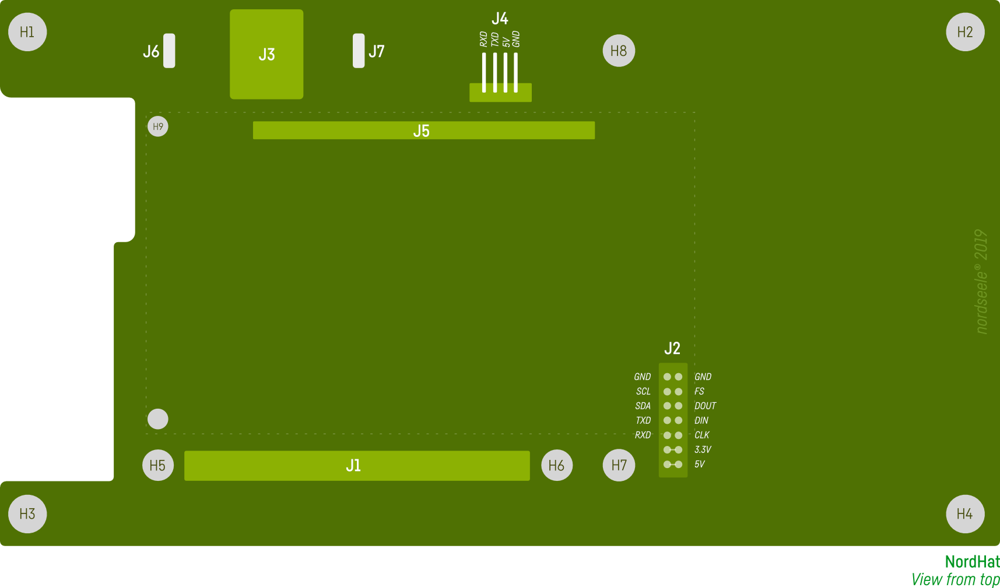
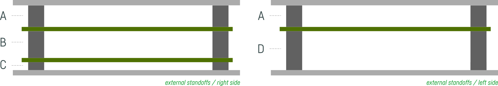

# Before you start...

### Disclaimer
You must have a prior experience building electronic projects, soldering, etc. The necessary tools can be dangerous. This is not a beginner "DIY" project. All the things learned and tested during the construction of this prototype are reflected here, these informations are provided "as is". If you have been provided with a set of PCB of this 'nordhat' project, it is still a prototype and is still in development. Built it at your own risk.

You'll find the references on the silkscreen and in the BOM and some additional tips and explanations on this page. All the things learned and tested during the construction of this prototype are reflected here. If you choose another component than the one listed in the suggested BOM (encoders, jack connectors, etc) you should verify that the footprint and pin-out match, do this at your own risk.

---
# Hardware

### Dimensions

    Height: 84mm  
    Width: 150mm  
    Depth: 28mm  

## Headers and card to card connectors

#### J3, J7, J6 - The I2C section (middle/top of the board)
It's probably better to ***avoid soldering these connectors for now if you don't know what you're doing***, don't solder/order J3,J7,J6. This can be done later. For now, this section has not been tested and has no utility. If you choose to solder the jack connector despite this recommendation, you should ***NEVER connect a midi jack or audio jack to this plug***. If you solder the stereo jack connector, it can be soldered either on top or on the bottom of the board (see silkscreen) but it's recommended to solder it on the bottom. For J7 and J6, cut two pins from a male 2.54 breakable pin strip like the reference suggested. (Order only one if you order the Adafruit 392, it’s a pack of 10 pieces)

#### J4 - UART 4 pins angled header
If you're not planning to use the UART header, don't solder/order J4, it can also be done later if you change your mind. If you solder it on, this header should be placed/soldered on top of the board (even if the silkscreen is printed on the bottom). This header can be used with the Adafruit 954 cable. You should ***NEVER CONNECT THE 5V pin if the Raspberry Pi is powered from USB.***

#### J2, 02x07 pins - expansion board header
You should solder this 14 positions 2 rows header ***before soldering the OLED*** display. It would be impossible or very difficult to solder this afterwards.
#### J5 - OLED Header
Cut twenty pins from a male 2.54 breakable pin strip (see Adafruit 392 pack, as mentioned above)

____

## OLED display

Solder the expansion board header (J2) before soldering the OLED display.

___
## Buttons and encoders

### Buttons / Key switches
We’re using low actuation force key switches, but feel free to use another actuation force, in the same APEM 5E series. Note that you could use the 5G series which has the same footprint and a larger choice of caps available, but you'll have to modify the cutout (larger holes) of the top panel in consequence.

### Button caps
1SS, the only caps available for the 5E series. They're available in **multiple colors** and height but 7mm is the recommended height. read the data sheet of the manufacturer to find out how to adjust the reference. Adjust height depending on the thickness of the panel etc. Try different heights eventually. ***These caps are made for the APEM 5E series ONLY***.

### Encoders
We’re using encoders without detent and without switch with T18 shaft. The shortest available in this series.
Use PEC11R-4015F-N0024 if you want a D-Shaft.
### Encoder knobs
Use what you want, modify your choice of encoder/shaft in consequence. The encoders knobs used on the "Nord Hat" prototype are not available to buy.  
___
## Standoffs

The NordHat prototype uses M3 rounded steel standoffs from the **WA-SMSI series made by Würth Elektronik** for H1, H2, H3, H4. The mounting holes have been specifically designed for these standoffs. The diameter of the holes is 4.4mm. If you do not use the WA-SMSI standoffs and prefer using some regular HEX standoffs instead, make sure they have a diameter of 6mm minimum. Use regular M2.5 hex standoffs for non-visible / internal mounting holes (H5, H6, H9, H8, H7)

It is recommended to use the following dimensions, these are the minimum heights. The Raspberry should not be in contact with the bottom panel. There should be 1 or 2mm of clearance between the panel and and the bottom of the RPI, especially if you're using an aluminium panel.

| holes (h) | position | length  | type  | thread | quantity | sku
| :---: | :---: |:-------: | :-----: | :------: | :--------: | :----:
| 1, 2, 3, 4 | A | 7mm   | FF  | M3 | 4 | WA-SMSI 9774070360R
| 1, 3 | D  | 15mm   |  FF | M3  | 2 | WA-SMSI 9774150360R
| 5, 6, 9   | RPI | 11mm  | MF  | M2.5 | 3 | use hex
| 8, 7   | EXP | 10mm  | FF  | M2.5 | 2 | use hex
| 2, 4 | C | 3mm   |  FF | M3  | 2 | WA-SMSI 9774030360R
| 2, 4 | B | 10mm |  FF | M3  | 2 | WA-SMSI 9774100360R

### Additional Hardware used for assembling the standoffs
Different possible combinations. Get these lines:
- ***Headless screws M3 8mm***   
- ***M2.5 6mm screws***
- ***Flat head screws M3 10mm and 6mm (Use normal head if your top panel doesn't have countersunk holes)***
- ***M2.5 nylon washers*** (optional)
- ***M2.5 nuts***

___
## Panels and screen protection
We provide two sets of files (dxf and fpd) for making the top and bottom panels. They have countersunk holes and chamfer. If you want to make acrylic panels you'll have to edit the files to remove the chamfer and countersinks. The recommended thickness is 2mm. The viewing angle of the OLED display will be affected if the thickness is more than 2mm.

It is recommended to use a screen protection made of Perspex/ plexiglas. Less than 1mm thick. It is placed between the top panel and the display. Use double sided adhesive tape to attach it. The dimensions should be 4cm x 7cm maximum.
____

## GPIO

### Keys GPIO

- K1 : GPIO 06
- K2 : GPIO 27
- K3: GPIO 23

### Encoders GPIO

- E1A : GPIO 26  
  E1B : GPIO 13  

- E2A : GPIO 05  
  E2B : GPIO 22  

- E3A : GPIO 04  
  E3B : GPIO 17

### OLED display

- Reset : GPIO 25
- DC : GPIO 24

### UART

Using the Adafruit 954 cable:
- white lead TX
- green lead RX
- black lead GND
- ***DO NOT connect the red lead if the Pi is powered from USB !***

  `screen /dev/cu.usbserial* 115200`
____

### Issues

If you encounter an hardware issue, check your soldering and reflow if necessary. Otherwise, create an issue in this repository. Questions related to installing Norns or any other environment should be posted to their respective repositories/forum/creators, the install instructions of the Norns environment that are provided in this repository have been tested but are only here for information purposes. The Raspberry Pi GPIO used for connecting the encoders, keys, OLED of this board are listed in readme.md. Two overlay (.dts) files are provided in the "overlays" folder.
